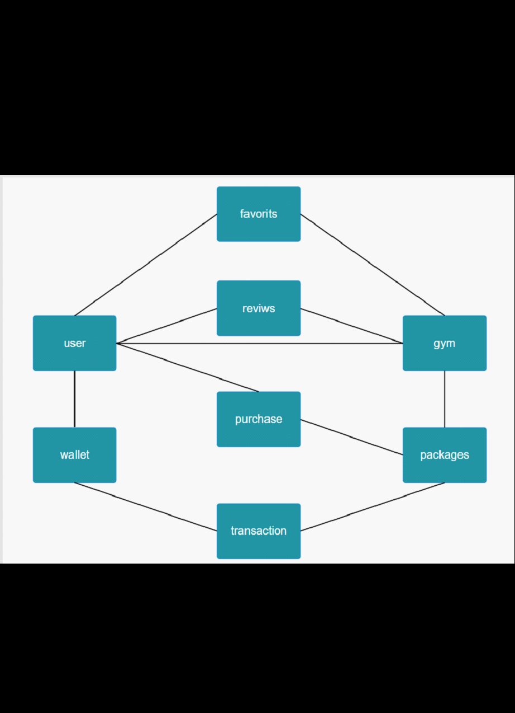

# Fitness App 🏋️‍♀️

A Django-based fitness management platform.  
This project provides a backend system for managing users, gyms, packages, payments, and user interactions.  

---

## Features
- **Accounts**: user authentication & profile management  
- **Gyms**: manage gym information  
- **Packages**: subscription and membership plans  
- **Finance**: wallet, purchases, and transactions  
- **Interactions**: user favorites and reviews  

---

ER diagram
fitness

-----------------------

Users
•	id
•	username / phone (برای ورود)
•	password
•	first_name
•	last_name
•	birth_date
•	role (enum: customer, owner, admin)
•	referral_code (کدی که خودش داره)
•	referred_by (کسی که معرف بوده)
-------------------
Gyms
•	id
•	owner_id (FK → Users)
•	name
•	description
•	location ( lat, lng)
•	address
•	working_hours
•	banners / images
--------------------
Packages
•	id
•	gym_id (FK → Gyms)
•	title
•	description
•	price
•	duration (مثلا ۱ ماهه، ۳ ماهه)
-------------------
Purchases
•	id
•	user_id (FK → Users)
•	package_id (FK → Packages)
•	purchase_date
•	expire_date
•	payment_status
--------------
Wallet (برای صاحب باشگاه)
•	id
•	owner_id (FK → Users where role=owner)
•	balance
•	updated_at
----------------
Transactions
•	id
•	wallet_id (FK → Wallet)
•	purchase_id (FK → Purchases)
•	amount
•	type (credit/debit)
•	created_at
---------------------
Reviews
•	id
•	user_id
•	gym_id
•	rating (1-5)
•	comment
•	created_at
-------------------------------
Favorites
•	id
•	user_id
•	gym_id
---------------------------
FAQs
•	id
•	question
•	answer
---------------------------
Tickets (برای سوال و جواب باکس)
•	id
•	user_id
•	admin_id
•	message
•	status (open/closed)
•	created_at

-------------------------------

docker exec -it fitness_app-db-1 psql -U myuser -d mydb
\dt public.*SELECT * FROM auth_user;

